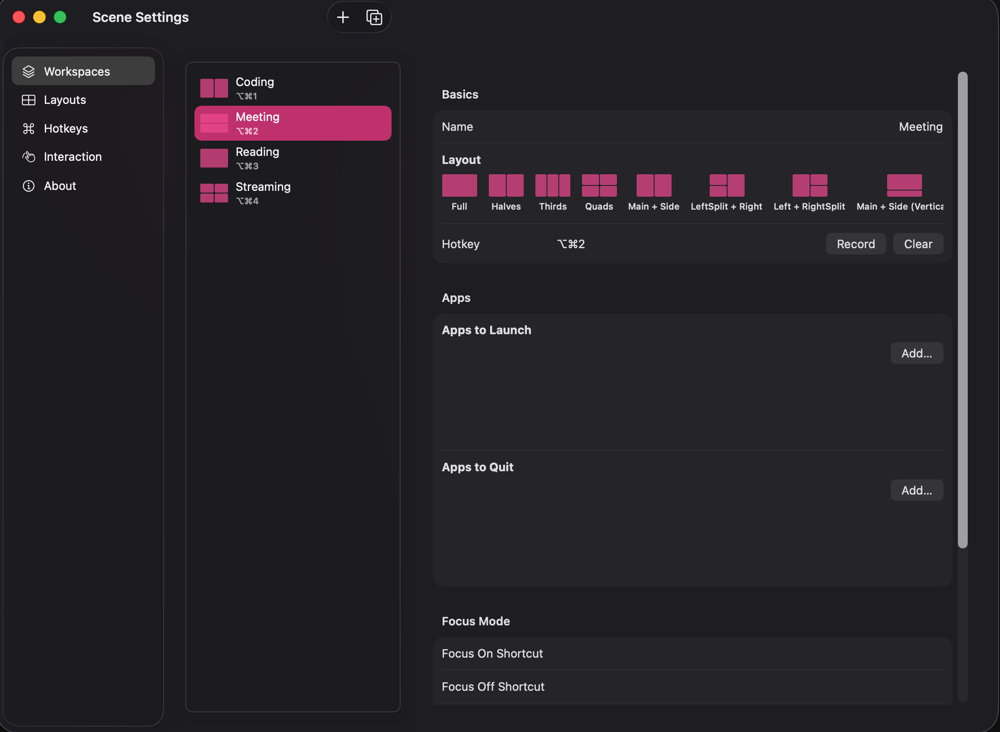
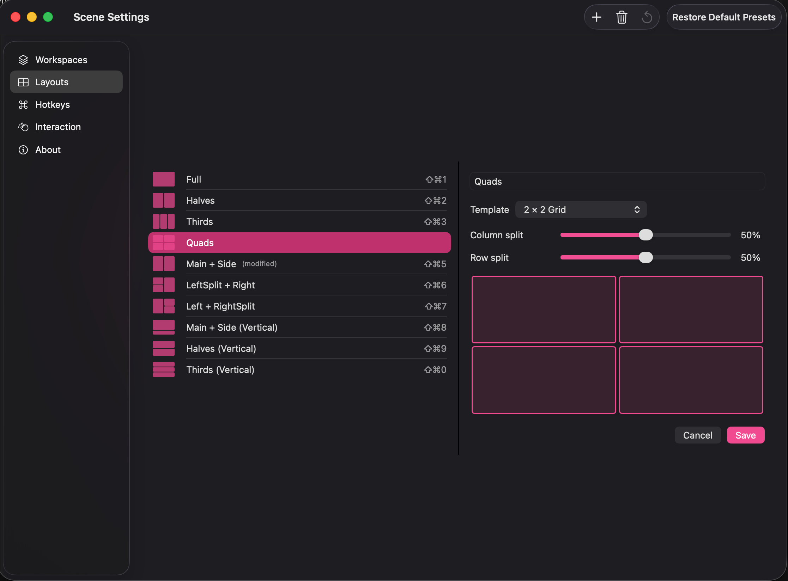

# Scene

> 撳一下。Window 入位、App 啟動、Focus 模式 kick in。好似 [Rectangle](https://rectangleapp.com) 嘅 snap layout 咁，但係多埋**情境（Workspaces）**將 app + layout + Focus mode 一齊 bundle 起，加上**自動觸發** — 接駁 monitor、夾啱時間、撞正 calendar event 都會自己 fire。

免費、開源 macOS menu bar 視窗管理工具。純 Swift 寫，零外部 dependency，Apple notarized。需要 macOS 14（Sonoma）或以上。Universal binary — Apple Silicon 同 Intel 都行到。

[](LICENSE) [](https://www.apple.com/macos/) [](https://github.com/ChiFungHillmanChan/macbook-resizer/releases/latest) [](https://github.com/ChiFungHillmanChan/macbook-resizer/releases/latest) [](https://github.com/ChiFungHillmanChan/macbook-resizer/stargazers)



> English version: [README.md](README.md)

## 點解揀 Scene？

呢個紅海入面，Scene 嘅 differentiator：

|                                                        | Scene         | [Rectangle](https://rectangleapp.com) | [Magnet](https://magnet.crowdcafe.com) | [Loop](https://github.com/MrKai77/Loop) | [Moom](https://manytricks.com/moom) |
| ------------------------------------------------------ | :-----------: | :-----------------------------------: | :------------------------------------: | :-------------------------------------: | :---------------------------------: |
| 售價                                                   | 免費          | 免費                                  | $7.99                                  | 免費                                    | $10                                 |
| 開源                                                   | 係            | 係                                    | 唔係                                   | 係                                      | 唔係                                |
| Snap 邊位排列                                          | ✓             | ✓                                     | ✓                                      | ✓                                       | ✓                                   |
| 自訂 layout 編輯器                                     | ✓ tree-split  | —                                     | —                                      | —                                       | ✓                                   |
| **情境 Workspaces**（apps + layout + Focus 一鋪過）    | ✓             | —                                     | —                                      | —                                       | partial                             |
| **自動觸發**（monitor / 時間 / calendar）              | ✓             | —                                     | —                                      | —                                       | —                                   |
| 拖 window 換位                                         | ✓             | —                                     | —                                      | —                                       | —                                   |
| 繁體中文（HK / TW）                                    | ✓             | —                                     | —                                      | —                                       | —                                   |

如果你淨係要 snap-to-edge 嘅 tiling，Rectangle 已經夠用。如果你想撳一下就切換成個情境 — apps、layout、Focus mode 加上自動觸發 — 嗰個就係 Scene。

## 安裝

**用 Homebrew**（推薦）：

```bash
brew install --cask chifunghillmanchan/tap/scene
```

自動幫你清走 quarantine flag，唔會彈「cannot be verified」嘅 Gatekeeper 警告。首次開 Scene 嗰陣，去 **System Settings → Privacy & Security → Accessibility** 撳着 Scene 就得。

**或者直接下載 DMG**：**[Scene-0.7.1.dmg](https://github.com/ChiFungHillmanChan/macbook-resizer/releases/download/v0.7.1/Scene-0.7.1.dmg)**（Universal：Apple Silicon + Intel，macOS 14+，Apple notarized — 唔會彈 Gatekeeper 警告）

所有版本：[Releases page](https://github.com/ChiFungHillmanChan/macbook-resizer/releases) · 用 DMG 嘅話，跟住 [`docs/INSTALL.md`](docs/INSTALL.md) 做一次性嘅 Gatekeeper + Accessibility 授權步驟。

## 示範片

[](docs/media/scene-marketing.mp4)

▶ [睇 30 秒示範片](docs/media/scene-marketing.mp4)（MP4，13 MB）

## v0.7.1 嘅新功能

**Layout 方向修正** — 上下唔對稱嘅 layout（canvas 自訂 layout、Main + Side（縱向）、L 形 template）唔會再上下倒轉咁 apply。Editor、縮圖同實際上螢幕嘅結果而家完全一致。如果你之前為咗遷就個 bug 而倒轉咗自己個 layout，記得改返一次 — 以後點畫就點 apply。

**自訂 layout 穩定性** — 用 canvas 整嘅自訂 layout apply 咗之後,resize 入面嘅窗口唔會再觸發 seam-drag 亂咁推第啲窗口去另一個 layout 嘅位置。Tree 形 layout 而家自由 resize;template layout 保留原有嘅聯動 resize。Tests: 363/363。

完整版本歷史見 [`CHANGELOG.md`](CHANGELOG.md)。

## 功能

- **10 個內建 layout preset** — Full、Halves、Thirds、Quads、Main + Side（70/30）、LeftSplit + Right、Left + RightSplit，加埋三個縱向 variant：Main + Side（縱向）、Halves（縱向）、Thirds（縱向）
- **自己畫 layout** — 11 種 grid template（columns / rows / 2×2 / 3×2 / 4 種 L-shape）連 proportion slider；同埋自由 tree-split 嘅自訂排列，撳「+ Custom」由零開始畫任何形狀
- **每個 layout 自訂 hotkey** — 撞 chord 會 block-save（一個 chord 只屬於一個 layout 或者 workspace）
- **Smooth window animation** — duration 100–500 ms 可調，easing 揀 Linear / Ease Out / Spring；native app 60Hz、Electron app 30Hz
- **設定視窗** — Workspaces / Layouts / Hotkeys / Interaction / About（menu bar icon → Settings… 或 ⌘,）
- **撳一下，window 全部入位** — frontmost 入 slot 1，其餘按 z-order 排
- **Overflow 處理** — 多過 slot count 嘅 window 自動 minimize
- **拖 window 換位** — 揸住 placed window 拖落另一個 placed window，即時換位
- **拖邊同步** — Tile 完之後拖一個 window 嘅邊，隔籬嗰個自動跟住縮放填 gap
- **Electron-aware** — Cursor、VS Code、Slack 等做 ±5px retry 修正
- **Multi-display** — 只 rearrange 滑鼠所在 screen 嘅 window
- **Dock / menu bar aware** — 用 `visibleFrame`，window 永遠唔會滑入去佢哋下面
- **Animation 性能保護** — 7+ 個 window fall back 到 instant placement
- **零外部 dependency** — 純 Foundation、AppKit、SwiftUI、Carbon

## Layout 表

| ID | 名 | Slot |
|---|---|---|
| 1 | Full | 1（100%）|
| 2 | Halves | 2（50/50）|
| 3 | Thirds | 3 個等闊 column |
| 4 | Quads | 2×2 grid |
| 5 | Main + Side | 70% / 30% |
| 6 | LeftSplit + Right | 左邊 column 上下分，右邊全高 |
| 7 | Left + RightSplit | 左邊 column 全高，右邊上下分 |
| 8 | Main + Side（縱向）| 上 row 70%，下 row 30% |
| 9 | Halves（縱向）| 2 個等高 row |
| 10 | Thirds（縱向）| 3 個等高 row |

## 由 source build

### Prerequisites

- macOS 14+
- Xcode 16+（Mac App Store 免費下載）
- Swift 5.9+（Xcode 入面有）

### 用 Xcode build

```bash
git clone https://github.com/ChiFungHillmanChan/macbook-resizer.git
cd macbook-resizer
open SceneApp/SceneApp.xcodeproj
```

Xcode 揀 `SceneApp` scheme → ⌘R。App 以 menu bar extra 形式行（冇 Dock icon）。

### Build distributable DMG

```bash
./scripts/build-dmg.sh 0.7.1    # 出 dist/Scene-0.7.1.dmg（universal + notarized）
```

Build universal（arm64 + x86_64）binary，Developer ID sign，submit 去 Apple notary，pack 入 DMG 連 `Applications` drop shortcut。Apple Silicon 同 Intel Mac 用同一個 DMG。如果想 local iterate DMG layout，set `SKIP_NOTARY=1` 會 skip Apple notary submission，改用 ad-hoc sign。

### 跑 SceneCore 嘅 unit test

Layout / animation / store / hotkey / drag-swap / seam reflow / 自訂 tree / 診斷 / hotkey 衝突全部邏輯都喺 `SceneCore`，係 Swift package，唔使 Xcode：

```bash
swift test
```

363 個 unit test 覆蓋 layout 數學、window-to-slot mapping、animation 狀態機、JSON persistence、hotkey 衝突、drag-to-swap 邏輯、seam reflow、自訂 layout tree round-trip、診斷 writer + sanitizer、update nudge 嘅 semver 比較、edge case。

## 用法

1. 第一次 launch，Scene 會問 **Accessibility 授權**。喺 System Settings → Privacy & Security → Accessibility 開咗佢。
2. Click menu bar 嘅 Scene icon（`rectangle.3.group`）→ 會見到 10 個 layout preset 同 4 個 workspace。
3. Click 任何 layout preset，或者撳 ⌘⌃1 – ⌘⌃0（⌘⌃0 = 第 10 個）。Workspace 撳 ⌘⌥1 – ⌘⌥4。
4. Quit 用 menu 嘅 **Quit Scene**。

### Default hotkey 表

| Shortcut | Layout |
|---|---|
| ⌘⌃1 | Full |
| ⌘⌃2 | Halves |
| ⌘⌃3 | Thirds |
| ⌘⌃4 | Quads |
| ⌘⌃5 | Main + Side |
| ⌘⌃6 | LeftSplit + Right |
| ⌘⌃7 | Left + RightSplit |
| ⌘⌃8 | Main + Side（縱向）|
| ⌘⌃9 | Halves（縱向）|
| ⌘⌃0 | Thirds（縱向）|

Workspace 默認 hotkey：

| Shortcut | Workspace |
|---|---|
| ⌘⌥1 | Coding |
| ⌘⌥2 | Meeting |
| ⌘⌥3 | Reading |
| ⌘⌥4 | Streaming |

所有 layout 同 workspace hotkey 喺 Settings → Hotkeys 入面 re-bind 得；layout **同** workspace 之間嘅 chord 衝突儲存時 block-save。

## 自動化（v0.7+）

Scene 提供兩個自動化入口，任何工具都可以叫 Scene 做嘢：

### URL scheme

```bash
open "scene://workspace/Coding"               # 用名啟動情境
open "scene://workspace/Friday%20review?force=1"   # 無視 Free Mode
open "scene://layout/Halves"                  # 套用佈局
open "scene://free-mode/toggle"               # 切換 Free Mode
```

Terminal、Raycast script command、Alfred file action、Stream Deck「Open URL」掣、Keyboard Maestro，任何識 URL 嘅工具都可以用。

### Shortcuts.app + Siri（macOS 14.1+）

Scene 喺 Shortcuts.app 註冊咗 5 個 actions（喺「Scene」分類入面）：

- **Activate Workspace** — 揀一個情境啟動
- **Apply Layout** — 套用佈局喺當前螢幕
- **List Workspaces** — 攞晒情境名（用嚟接落後面其他 actions）
- **Toggle Free Mode**
- **Set Free Mode**（Bool 參數）

呢啲 actions 會跟住 iCloud sync 去 iPhone / iPad / Apple Watch 嘅 Shortcuts，仲可以用 Siri：

- 「Hey Siri, activate Scene workspace Coding」
- 「Hey Siri, apply Scene layout Halves」
- 「Hey Siri, toggle Scene Free Mode」

> AppIntents 要 macOS 14.1+。URL scheme 喺 Scene 支援嘅所有 macOS 版本（14.0+）都用得。

### Edge case 行為

| 情況 | 行為 |
|---|---|
| Window 多過 slot | 前 N 個按 z-order 入 slot，其餘 minimize |
| Window 少過 slot | Window 入晒，多餘 slot 留空 |
| 冇 visible window | macOS 通知（或 menu bar icon 閃，如果通知被禁）|
| 中途 revoke permission | Menu bar icon 變灰；hotkey 2 秒內 unregister |
| Electron app | Window 偏離 target 做一次 ±5px 修正 |
| System Settings | Apple 強制最細尺寸 — position 入位但 size 縮唔細 |

## 架構

```
macbook-resizer/
├── Package.swift
├── Sources/SceneCore/          # 純邏輯，唔使 Xcode unit test 得
│   ├── AX/                     # Accessibility API wrapper
│   ├── Animation/              # Clock, FrameInterpolator, AnimationRunner
│   ├── Display/                # screen picker
│   ├── Interaction/            # HotkeyManager, DragSwapController,
│   │                           #   WindowAnimationSink, WindowMoveObserving
│   ├── Layout/                 # Slot, Layout, LayoutEngine, Plan, Geometry,
│   │                           #   LayoutTemplate, CustomLayout, PresetSeeds, LayoutStore
│   ├── Settings/               # AnimationConfig, HotkeyBinding, DragSwapConfig,
│   │                           #   SettingsStore, Cancellable
│   └── Workspace/              # Workspace, WorkspaceTrigger, WorkspaceSeeds,
│                               #   WorkspaceStore, FocusModeReference
├── Tests/SceneCoreTests/       # 363 個 XCTest case
├── SceneApp/                   # Xcode project — menu bar shell + 設定視窗
│   └── SceneApp/
│       ├── Animation/          # WindowAnimator（CVDisplayLink + AX bridge）
│       ├── Interaction/        # AXMoveObserverGroup, AXWindowLookup,
│       │                       #   DragSwapAnimationSink
│       ├── Resources/          # Localizable.xcstrings, InfoPlist.xcstrings
│       ├── Settings/           # SettingsWindowController + 5 個 tab
│       │                       #   (Workspaces / Layouts / Hotkeys / Interaction / About)
│       │                       #   + LayoutEditorView + LayoutPickerView + LayoutThumbnail
│       │                       #   + WorkspaceEditorView + WorkspaceTriggerEditor
│       │                       #   + AppPickerView + HotkeyCaptureView
│       ├── Stores/             # LayoutStoreViewModel, SettingsStoreViewModel,
│       │                       #   WorkspaceStoreViewModel
│       ├── Workspace/          # AppLauncher, FocusController, WorkspaceActivator
│       │   └── Triggers/       #   MonitorTriggerWatcher, TimeTriggerScheduler,
│       │                       #   CalendarTriggerWatcher, TriggerSupervisor
│       ├── SceneAppApp.swift   # @main + MenuBarExtra
│       ├── AppDelegate.swift
│       ├── Coordinator.swift   # orchestration 層
│       ├── MenuBarContentView.swift
│       ├── OnboardingView.swift
│       ├── OnboardingWindowController.swift
│       └── NotificationHelper.swift
└── docs/
    ├── INSTALL.md              # 用戶安裝步驟
    ├── TESTING.md              # 手動 smoke test checklist（V0.1–V0.5）
    └── media/                  # 示範片 + screenshots
```

故意分層：**`SceneCore` 完全 framework-neutral** — 冇 SwiftUI、冇 Combine、冇 ObservableObject。所有 hard logic（AX call、layout 數學、animation 狀態機、store CRUD、drag-to-swap、seam reflow、診斷）住喺度，363 個 unit test 覆蓋。**`SceneApp` 係薄殼**，只負責 SwiftUI binding、AppKit lifecycle，同埋 framework-neutral library 做唔到嘅 AppKit/AX bridge（`WindowAnimator`、`AXMoveObserverGroup`、`AXWindowLookup`、`DragSwapAnimationSink`）。SceneCore 用 closure-based observation 同 SceneApp 通訊（`@MainActor class FooStoreViewModel: ObservableObject` 做 adapter）。

`swift test` 由 command line 跑得，唔使 Xcode；只有最後 `.app` build 先要。

詳細架構 + 進階文檔：[Wiki（繁體中文）](https://github.com/ChiFungHillmanChan/macbook-resizer/wiki/Home-zh-HK)

## 設定持久化

三個 JSON 檔，atomic write 入：

```
~/Library/Application Support/Scene/
├── layouts.json      # 10 個 seed + 你 add 嘅 custom layout + 每個嘅 hotkey
├── settings.json     # animation / drag-swap 設定
└── workspaces.json   # 4 個 workspace seed + 你 add 嘅 custom workspace + active workspace ID
```

刪呢個 folder 就 reset 返出廠 state。

## 路線圖

- **Per-display layouts** — 唔同 monitor apply 唔同 preset。
- **Pattern learning** — 觀察用家手動拖 window 嘅 pattern，建議「下午 2-5pm 通常 Cursor 70 + Chrome 30，要唔要 save 做 preset？」。
- **AI / 自然語言 input** — 打「cursor 左 chrome 右」→ LLM → layout JSON。
- **Per-app rule** — 例如「Slack 永遠入 slot 4」。
- **Launch at Login** UI。
- **Free-form canvas drag** layout editor（EpycZones 嗰種）。

## License

MIT — 睇 [`LICENSE`](LICENSE)。
